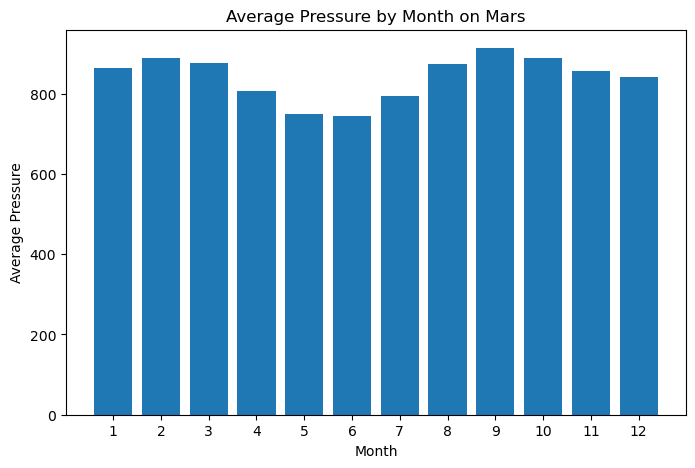

Module 11 Challenge

Module 11 Challenge

# Mars News and Weather Data Scrapping & Analysis

## Project Overview

This project involves web scraping and data analysis to extract and analyze Mars news articles znd Mars weather data. It leverages Splinter for automated browsing and BeautifulSoup got HTML psrsing. The extracted data is structured using Pandas and visualized using Matplotlib.

## Technologies Used

* Python
* Splinter (for automated browsing)
* Pandas
* Matplotlib (for data visulaiztion)
* Jupyter Notebook (for executing the project)

## Deliverables

### Scrape Titles and Preview Text from Mars News
* Automated the browsing of the [Mars News Site](https://static.bc-edx.com/data/web/mars_facts/temperature.html)
* Identify and extract:
* Store extracted data in a Python dictionary format:
```
 {'title': "NASA's MAVEN Observes Martian Light Show Caused by Major Solar Storm",
'preview': "For the first time in its eight years orbiting Mars, NASA’s MAVEN mission witnessed two different types of ultraviolet aurorae simultaneously, the result of solar storms that began on Aug. 27."}
```
* Store multiple articles in a list and optionally export to JSON.

### Automated the browsing of the Mars temperature Data Site at [Mars Temperature Data](https://static.bc-edx.com/data/web/mars_facts/temperature.html)
* Scrape weather data using BeautifulSoup.
* Extract the following fields:
    * id: Transmission ID
    * terrestrial_data: Earth data
    * sol: Martian day count since Curiosity lasned
    * ls: Solar longitude
    * month: Martian month
    * min_temp: Minimum daily temperature (°C)
    * pressure: Atmosheric pressure (Pa)

### Datea Processing & Analysis
* Convert data types (datetime, int, float).
* Analyze Mars weather patterns:
    
    * Number of months on Mars
    * Numbr of Martian days in dataset
    * Coldest and warmest months

   

